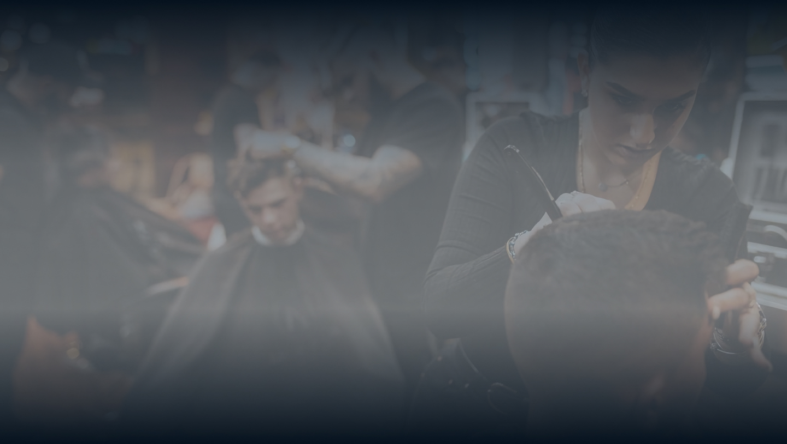

<h1 align="center"> Barber </h1>

Desenvolvimento exclusivo e gratuito.

  <a href="#-tecnologias">Tecnologias</a>&nbsp;&nbsp;&nbsp;|&nbsp;&nbsp;&nbsp;
  <a href="#-projeto">Projeto</a>&nbsp;&nbsp;&nbsp;|&nbsp;&nbsp;&nbsp;
  <a href="#-layout">Layout</a>&nbsp;&nbsp;&nbsp;|&nbsp;&nbsp;&nbsp;
  <a href="#memo-licença">Licença</a>

  

 

  

## 🚀 Tecnologias

Esse projeto foi desenvolvido com as seguintes tecnologias:

- HTML e CSS
- JavaScript
- Git e Github
- Figma
- Sass

## 💻 Projeto

Projeto criado através do canal do Youtuber "Sujeito Programador!" [Sujeito Programador](https://www.youtube.com/@Sujeitoprogramador)

## :memo: Licença

Esse projeto está sob a licença MIT.

